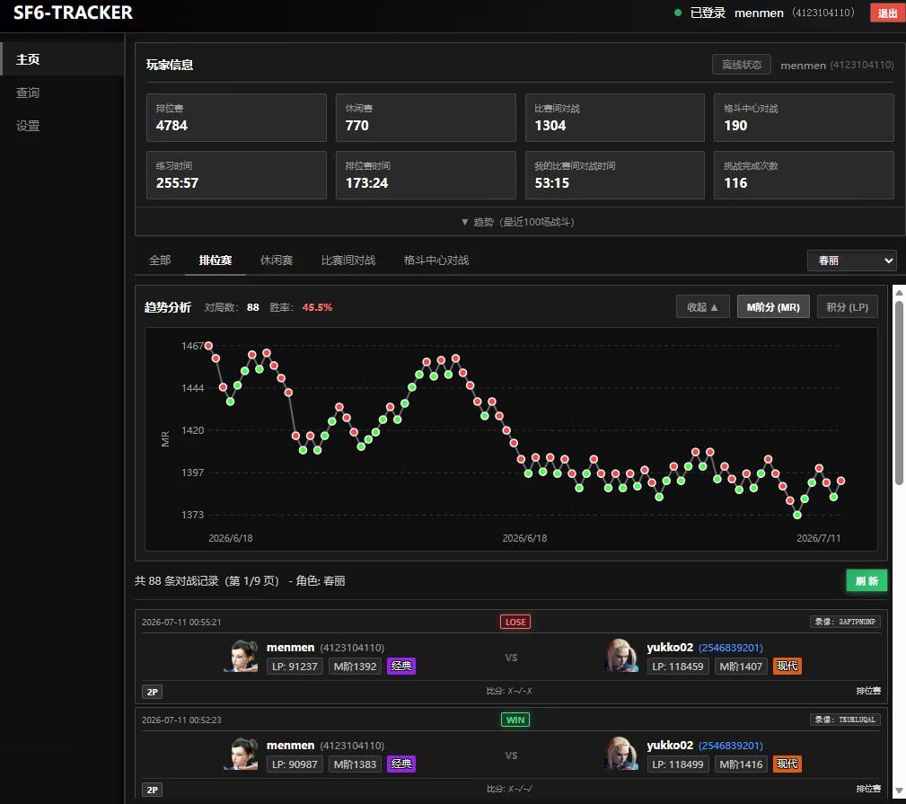

<div align="center">

# 🥊 SF6 TRACKER

### **FIGHT! 你的每一场战斗，都值得被记录。**

---

*追踪对战记录 · 解析角色胜率 · 洞察 LP/MR 趋势*

---

</div>

## ⚡ FIGHT! — 这是什么？

> *"不是每一场格斗都会被遗忘。"*

SF6 Tracker 是一款专为《街头霸王6》玩家打造的战绩追踪工具。通过官方接口采集你的对战数据，将每一场格斗的胜负、角色表现、LP/MR 变化趋势可视化呈现。

**均使用官方接口，请勿频繁查询。**

- 有朋友就要问了：为什么不直接去官网/游戏查？
- 更方便的查成分（）其实是按照自己的想法做了一些更方便的功能，数据都是官方的。

---

## 🎮 ROUND 1 — 功能特性



| 招式 | 说明 |
|------|------|
| 🥊 **战绩查看** | 最近对战记录，胜负、角色、LP 变化一目了然 |
| 🔍 **玩家查询** | 搜索任意玩家，查看完整战绩数据 |
| 📊 **角色胜率** | 各角色对阵胜率统计，知己知彼 |
| 📈 **趋势图表** | LP / MR 变化曲线，见证你的成长轨迹 |
| ⭐ **收藏功能** | 收藏常用对手，支持备注编辑 |
| 🌓 **主题切换** | 暗色 / 亮色主题，随时切换战斗氛围 |
| 🖥️ **桌面应用** | 独立桌面窗口运行，沉浸式体验 |

---

## 🕹️ ROUND 2 — 技术栈

```
┌─────────────────────────────────────────────────┐
│  BACKEND    │  FastAPI + Uvicorn                │
│  FRONTEND   │  原生 HTML / CSS / JavaScript     │
│  CRAWLER    │  Requests + Pandas                │
│  DESKTOP    │  pywebview                        │
│  LOGIN      │  Selenium (Edge)                  │
└─────────────────────────────────────────────────┘
```

---

## 🏁 FINAL ROUND — 安装

```bash
# 克隆项目
git clone https://github.com/HuuuugePony/sf6-tracker.git
cd sf6-tracker

# 安装依赖
pip install -r requirements.txt
```
或者直接下载已发布的版本 [SF6-Tracker.exe](https://github.com/HuuuugePony/sf6-tracker/releases/download/v0.2/SF6-Tracker-v0.2.exe)

---

## 🔥 再次对战！ — 运行方式

### 🖥️ 方式一：桌面应用（推荐）

```bash
python desktop_app.py
```

SF6-Tracker.exe 文件直接运行

> 启动原生桌面窗口，无需打开浏览器，沉浸式战斗分析。

### 🌐 方式二：Web 服务

```bash
uvicorn main:app --host 127.0.0.1 --port 8000
```

然后在浏览器中访问：**`http://localhost:8000`**

---

## 🎯 HOW TO PLAY — 使用说明

```
  STEP 1  →  启动应用，点击右上角「登录」按钮
  STEP 2  →  在弹出的浏览器中登录 CAPCOM 账号（弹出可能会很慢，1分钟估计）
  STEP 3  →  登录成功后点击「获取用户信息」
  STEP 4  →  系统自动获取并展示你的对战记录
```

> 💡 **TIP**：登录成功后，系统将自动缓存你的数据，下次启动无需重新登录。

---

## 📂 STAGE SELECT — 项目结构

```
sf6-tracker/
├── crawler.py              # 🕷️ 采集核心逻辑
├── main.py                 # 🌐 FastAPI Web 服务
├── desktop_app.py          # 🖥️ 桌面应用入口
├── index.html              # 🎨 前端页面
├── desktop_styles.css      # 🎭 桌面端样式
├── chunli.ico              # 🎯 应用图标
├── player_info_schema.md   # 📋 玩家数据字段说明
├── sf6tracker.spec         # 📦 PyInstaller 打包配置
├── requirements.txt        # 📦 Python 依赖
└── README.md               # 📜 项目说明（你正在看的这个）
```

---

## 🏆 感谢对战！ — 版本

**v0.1** — *战斗才刚刚开始...*

**v0.2** — *新增排行榜、对局收藏、对手角色筛选等，优化布局操作！*

**v0.3** — *新增格斗圈，优化界面、动画、主题等！*

---

## 📜 License

MIT — *自由使用，像格斗精神一样传承。*

---

<div align="center">

### 如果觉得有用，请给一个 ⭐ **STAR** 支持！

**每一次 STAR，都是一记波动拳的力量。** 👊

[GitHub](https://github.com/HuuuugePony/sf6-tracker) · [Issues](https://github.com/HuuuugePony/sf6-tracker/issues)

</div>
